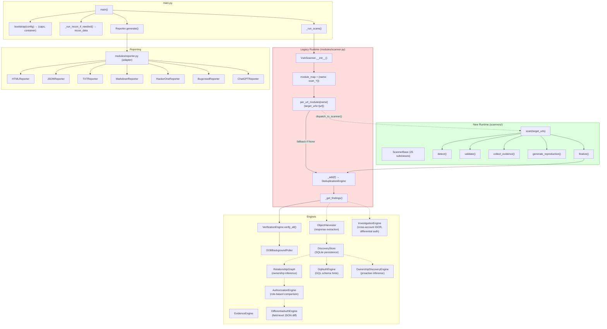
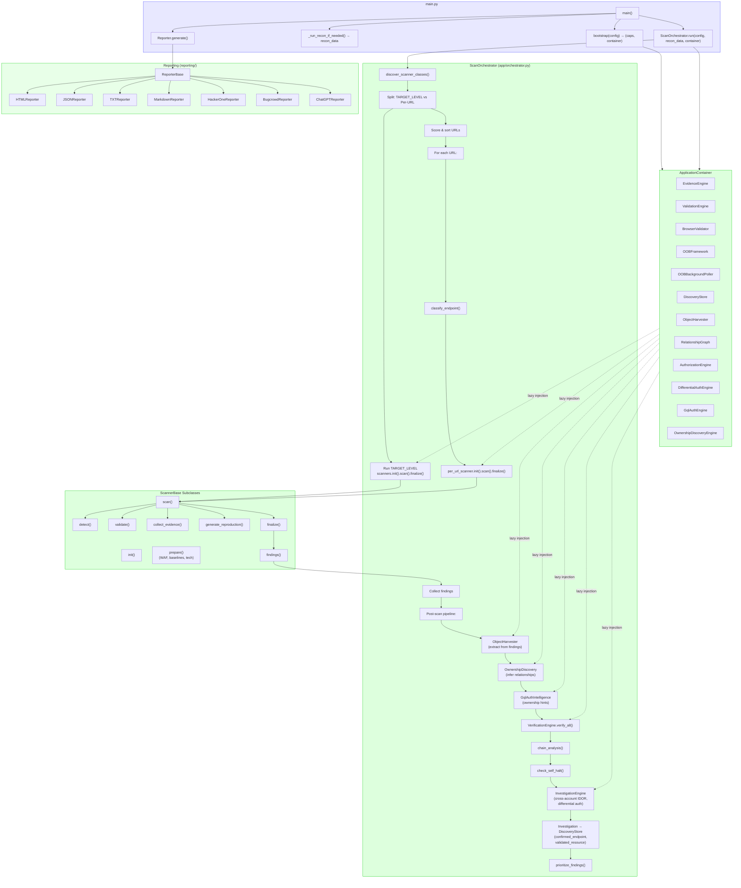

# Execution Flow Diagram

## Current (Dual Runtime)

```mermaid
flowchart TD
    subgraph main_py["main.py"]
        main["main()"]
        bootstrap["bootstrap(config) → (caps, container)"]
        recon["_run_recon_if_needed() → recon_data"]
        scans["_run_scans()"]
        report["Reporter.generate()"]
    end

    subgraph legacy["Legacy Runtime (modules/scanner.py)"]
        vs["VulnScanner.__init__()"]
        module_map["module_map = {name: scan_*()}"]
        per_url["per_url_modules[name](target_urls=[url])"]
        add["_add(f) → DeduplicationEngine"]
        get["_get_findings()"]
    end

    subgraph new["New Runtime (scanners/)"]
        scanner_base["ScannerBase (25 subclasses)"]
        detect["detect()"]
        validate["validate()"]
        evidence["collect_evidence()"]
        repro["generate_reproduction()"]
        scan["scan(target_urls)"]
        finalize["finalize()"]
    end

    subgraph engines["Engines"]
        ve["VerificationEngine.verify_all()"]
        ee["EvidenceEngine"]
        oob["OOBBackgroundPoller"]
        ds["DiscoveryStore\n(SQLite persistence)"]
        oh["ObjectHarvester\n(response extraction)"]
        rg["RelationshipGraph\n(ownership inference)"]
        ae["AuthorizationEngine\n(role-based comparison)"]
        da["DifferentialAuthEngine\n(field-level JSON diff)"]
        ga["GqlAuthEngine\n(GQL schema hints)"]
        ode["OwnershipDiscoveryEngine\n(proactive inference)"]
        ie["InvestigationEngine\n(cross-account IDOR,\ndifferential auth)"]
    end

    subgraph reporting["Reporting"]
        reporter_adapter["modules/reporter.py (adapter)"]
        html["HTMLReporter"]
        json["JSONReporter"]
        txt["TXTReporter"]
        md["MarkdownReporter"]
        h1["HackerOneReporter"]
        bc["BugcrowdReporter"]
        chat["ChatGPTReporter"]
    end

    main --> bootstrap
    main --> recon
    main --> scans
    main --> report

    scans --> vs
    vs --> module_map
    module_map --> per_url

    per_url -.->|"dispatch_to_scanner()"| scan
    per_url -->|"fallback if None"| add

    scan --> detect
    scan --> validate
    scan --> evidence
    scan --> repro
    scan --> finalize
    finalize --> add

    add --> get
    get --> ve
    ve --> oob

    get -.-> oh
    oh -.-> ds
    ds -.-> rg
    rg -.-> ae
    ae -.-> da
    ds -.-> ga
    ds -.-> ode
    get -.-> ie

    report --> reporter_adapter
    reporter_adapter --> html
    reporter_adapter --> json
    reporter_adapter --> txt
    reporter_adapter --> md
    reporter_adapter --> h1
    reporter_adapter --> bc
    reporter_adapter --> chat

    style legacy fill:#ffdddd,stroke:#cc0000
    style new fill:#ddffdd,stroke:#00cc00
    style engines fill:#ffffdd,stroke:#cccc00
```

## Target (New Architecture Primary)

```mermaid
flowchart TD
    subgraph main_py["main.py"]
        main["main()"]
        bootstrap["bootstrap(config) → (caps, container)"]
        recon["_run_recon_if_needed() → recon_data"]
        orchestrator["ScanOrchestrator.run(config, recon_data, container)"]
        report["Reporter.generate()"]
    end

    subgraph container["ApplicationContainer"]
        ee["EvidenceEngine"]
        ve["ValidationEngine"]
        bv["BrowserValidator"]
        oob["OOBFramework"]
        oob_poller["OOBBackgroundPoller"]
        ds["DiscoveryStore"]
        oh["ObjectHarvester"]
        rg["RelationshipGraph"]
        ae["AuthorizationEngine"]
        da["DifferentialAuthEngine"]
        ga["GqlAuthEngine"]
        ode["OwnershipDiscoveryEngine"]
    end

    subgraph orchestration["ScanOrchestrator (app/orchestrator.py)"]
        disc["discover_scanner_classes()"]
        split["Split: TARGET_LEVEL vs Per-URL"]
        tl["Run TARGET_LEVEL\nscanners.init().scan().finalize()"]
        score["Score & sort URLs"]
        loop["For each URL:"]
        classify["classify_endpoint()"]
        per_url["per_url_scanner.init().scan().finalize()"]
        collect["Collect findings"]
        pipeline["Post-scan pipeline:"]
        oh_feed["ObjectHarvester\n(extract from findings)"]
        ode_feed["OwnershipDiscovery\n(infer relationships)"]
        ga_feed["GqlAuthIntelligence\n(ownership hints)"]
        vp["VerificationEngine.verify_all()"]
        chain["chain_analysis()"]
        halt["check_self_halt()"]
        inv["InvestigationEngine\n(cross-account IDOR,\ndifferential auth)"]
        inv_feed["Investigation → DiscoveryStore\n(confirmed_endpoint,\nvalidated_resource)"]
        priority["prioritize_findings()"]
    end

    subgraph scanners["ScannerBase Subclasses"]
        init["init()"]
        prep["prepare()\n(WAF, baselines, tech)"]
        sdetect["detect()"]
        svalidate["validate()"]
        sevidence["collect_evidence()"]
        srepro["generate_reproduction()"]
        sscan["scan()"]
        sfinal["finalize()"]
        findings["findings()"]
    end

    subgraph reporting["Reporting (reporting/)"]
        reporter_base["ReporterBase"]
        html["HTMLReporter"]
        json["JSONReporter"]
        txt["TXTReporter"]
        md["MarkdownReporter"]
        h1["HackerOneReporter"]
        bc["BugcrowdReporter"]
        chat["ChatGPTReporter"]
    end

    main --> bootstrap
    main --> recon
    main --> orchestrator
    main --> report

    bootstrap --> container
    orchestrator --> container
    orchestrator --> disc

    disc --> split
    split --> tl
    split --> score
    score --> loop
    loop --> classify
    classify --> per_url

    tl --> sscan
    per_url --> sscan

    sscan --> sdetect
    sscan --> svalidate
    sscan --> sevidence
    sscan --> srepro
    sscan --> sfinal
    sfinal --> findings

    findings --> collect
    collect --> pipeline
    pipeline --> oh_feed
    oh_feed --> ode_feed
    ode_feed --> ga_feed
    ga_feed --> vp
    vp --> chain
    chain --> halt
    halt --> inv
    inv --> inv_feed
    inv_feed --> priority

    container -.->|"lazy injection"| tl
    container -.->|"lazy injection"| per_url
    container -.->|"lazy injection"| vp
    container -.->|"lazy injection"| oh_feed
    container -.->|"lazy injection"| ode_feed
    container -.->|"lazy injection"| ga_feed
    container -.->|"lazy injection"| inv

    report --> reporter_base
    reporter_base --> html
    reporter_base --> json
    reporter_base --> txt
    reporter_base --> md
    reporter_base --> h1
    reporter_base --> bc
    reporter_base --> chat

    style main_py fill:#e8e8ff,stroke:#4444ff
    style container fill:#ddffdd,stroke:#00cc00
    style orchestration fill:#ddffdd,stroke:#00cc00
    style scanners fill:#ddffdd,stroke:#00cc00
    style reporting fill:#e8ffe8,stroke:#00cc00
```

## Key: Red = Legacy, Green = New, Yellow = Both/Hybrid
